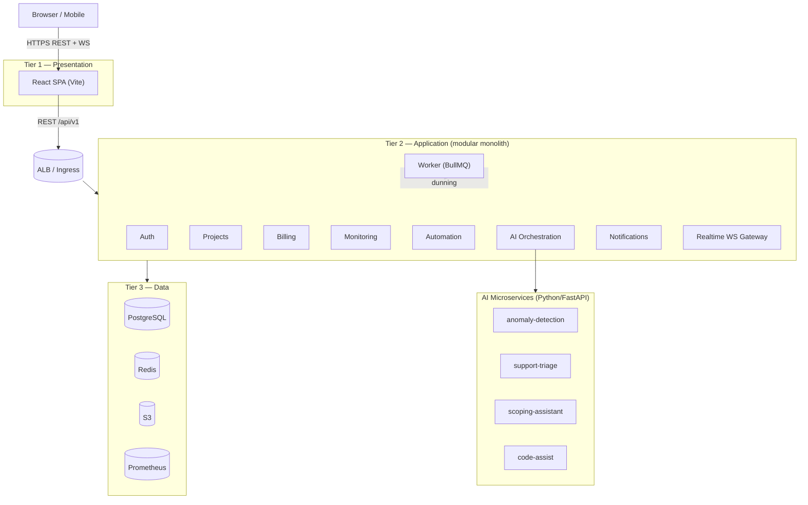

# Mugheer — Architecture

## Three-tier overview

## Tier rules (enforced in code AND at the network layer)

| Rule | Enforcement |
|---|---|
| Frontend never touches the DB | No DB drivers in frontend; `k8s/base/networkpolicy.yaml` denies presentation→data |
| Only Tier 2 queries the Data tier | Prisma exists only in backend-core/worker; security groups scope DB access to the app SG |
| Service-to-service calls authenticated | `InternalServiceGuard` (timing-safe shared token) on internal endpoints |
| Cross-tenant isolation | Every client-scoped query filters by `organization_id`; negative tests required |

## Service map

| Service | Language | Port | Responsibility |
|---|---|---|---|
| frontend | React/TS | 5173 | SPA, live dashboards |
| backend-core | NestJS/TS | 3000 | REST API, business logic, RBAC |
| worker | Node/TS | — | Queues: uptime probes, anomaly scans, reports, dunning, downsample |
| ai-anomaly | Python/FastAPI | 8101 | Robust-z + EWMA + IsolationForest anomaly detection |
| ai-triage | Python/FastAPI | 8102 | Ticket classification + draft replies (human-approved) |
| ai-scoping | Python/FastAPI | 8103 | Product request → structured brief |
| ai-codeassist | Python/FastAPI | 8104 | Retrieval-augmented internal code assistant |

## Key flows

- **Metric ingestion** → `POST /api/v1/monitoring/ingest` (client API key) or worker probes → `MonitoringMetric` rows → threshold rules evaluated inline → anomalies escalated via AI service → alerts → notifications (in-app + email) + WS push.
- **Ticket created** → triage service classifies + drafts reply → stored `isAiDraft=true` → human approves ("Approve & send") → governance log updated `humanApproved=true`.
- **Runbook execution** → trigger (threshold/schedule/alert) → condition matched → action dispatched → audit log entry (`SYSTEM`/`AI_AGENT` actor) → bounded by `maxRetries`.
